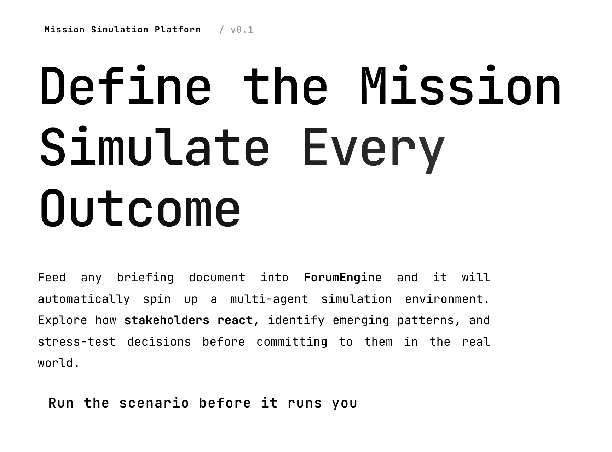

<div align="center">

# ForumEngine

**Multi-Agent Simulation Engine for Operational Decisions**

Run the scenario before it runs you.



</div>

## Overview

**ForumEngine** is a multi-agent simulation engine designed for mission planning and operational decision-making. Feed any briefing document — policy drafts, incident reports, strategic proposals — and ForumEngine will automatically spin up a high-fidelity simulation environment where autonomous agents with independent personalities, long-term memory, and behavioral logic interact freely.

Observe how stakeholders react, identify emerging patterns, and stress-test decisions before committing to them in the real world.

> **Input:** Upload mission documents (analysis reports, briefing materials) and describe what you want to simulate in natural language.
>
> **Output:** A detailed prediction report and a fully interactive simulation world you can explore.

## How It Works

ForumEngine runs a 5-step pipeline:

1. **Graph Building** — Extracts entities and relationships from seed documents, injects individual and group memory into a knowledge graph (GraphRAG)
2. **Environment Setup** — Generates agent profiles, extracts entity relationships, and configures simulation parameters
3. **Simulation** — Runs parallel multi-agent simulation with automatic scenario parsing and dynamic memory updates
4. **Report Generation** — A Report Agent with specialized tools analyzes the simulation results and produces a comprehensive report
5. **Deep Interaction** — Chat with any agent in the simulated world or query the Report Agent for deeper analysis

## Quick Start

### Prerequisites

| Tool | Version | Purpose | Check |
|------|---------|---------|-------|
| **Node.js** | 18+ | Frontend runtime (includes npm) | `node -v` |
| **Python** | ≥3.11, ≤3.12 | Backend runtime | `python --version` |
| **uv** | Latest | Python package manager | `uv --version` |

### 1. Configure Environment

```bash
cp .env.example .env
```

Edit `.env` with your API keys:

```env
# LLM API (any OpenAI SDK-compatible endpoint)
LLM_API_KEY=your_api_key
LLM_BASE_URL=https://your-llm-provider/v1
LLM_MODEL_NAME=your-model

# Zep Cloud (knowledge graph memory)
# Free tier is sufficient for basic usage: https://app.getzep.com/
ZEP_API_KEY=your_zep_api_key

# Optional: Boost LLM (faster model for parallel tasks)
# Only add these if you want to use a separate accelerated model
# LLM_BOOST_API_KEY=your_api_key
# LLM_BOOST_BASE_URL=your_base_url
# LLM_BOOST_MODEL_NAME=your_model_name
```

### 2. Install Dependencies

```bash
# Install everything (root + frontend + backend)
npm run setup:all
```

Or step by step:

```bash
# Node dependencies (root + frontend)
npm run setup

# Python dependencies (backend, auto-creates virtualenv)
npm run setup:backend
```

### 3. Launch

```bash
# Start both frontend and backend
npm run dev
```

| Service | URL |
|---------|-----|
| Frontend | `http://localhost:3000` |
| Backend API | `http://localhost:5001` |

Start individually:

```bash
npm run frontend   # Frontend only
npm run backend    # Backend only
```

### Docker Deployment

```bash
cp .env.example .env
# Edit .env with your keys, then:
docker compose up -d
```

Exposes ports `3000` (frontend) and `5001` (backend). Reads `.env` from the project root.

## Acknowledgements

ForumEngine's simulation engine is powered by **[OASIS](https://github.com/camel-ai/oasis)**.
